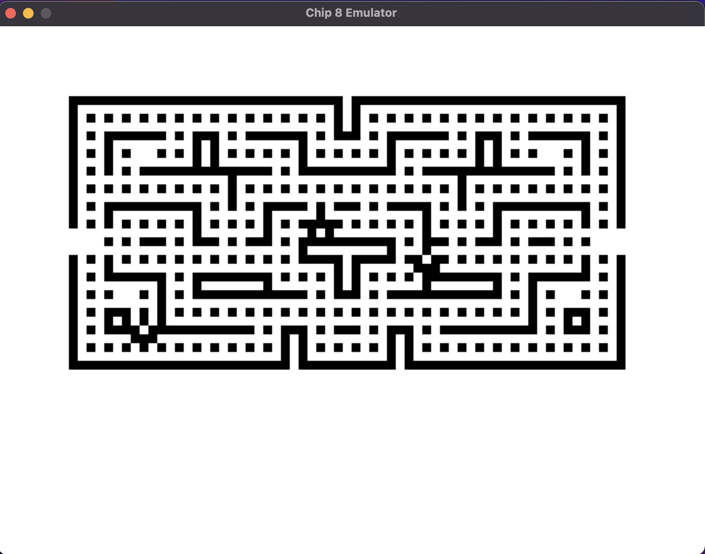

## Chip 8 Emulator
Based off -> http://devernay.free.fr/hacks/chip8/C8TECH10.HTM#2.4

### Testing
Testing is done using `pytest` and `unittest`. The command for running tests:

    pytest

### Notes about supported programs
This emulator was built specifically for running programs written for the original `CHIP-8` VM. So it does not support `SCHIP-8` or `XO-CHIP` programs. As for `CHIP-8` not all quirks observed in the original Cosmac VIP computers is fully supported yet. If you find any programs that should work but do not please submit an issue on GH, thanks.

### Keyboard layout
The key bindings are 1 to 1 to the original hex keyboard found in the Cosmac VIP computers. So that means `A` key matches to `A` in your keyboard and `1` to `1` and so on.
